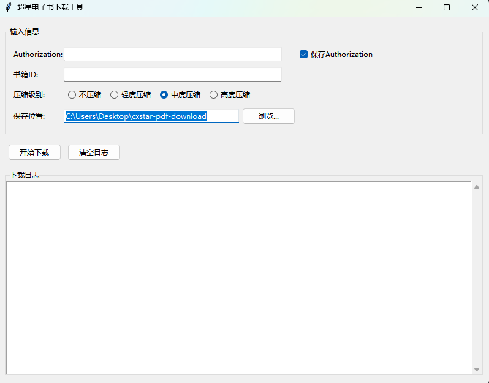

<h2 align="center">
    <p></p>
    <a href="https://github.com/Raabo/cxstar-pdf-download">Cxstar PDF Download</a>
</h2>

<p align="center">
    帮助您下载畅想之星您有权限阅读的pdf书籍
</p>

<p align="center">
    <a href="https://github.com/Raabo/cxstar-pdf-download">
        
    </a>
</p>

## 功能特点
- 支持下载完整PDF书籍
- 提供PDF压缩功能（需安装Ghostscript）
- 简单易用的图形界面
- 支持断点续传

## 使用前准备
### 1. 获取Authorization（需要先登录）
1. 打开【浏览器调试工具】(按F12）
2. 选择【控制台】（Console）
3. 复制并粘贴以下代码，回车执行后会自动复制到剪贴板：
```javascript
copy(document.cookie.match(/token=([^;]+)/)[1])
```

### 获取书籍id
* PC网页

    `https://www.cxstar.com/Book/Detail?ruid=29e2af210001a5XXXX&packageruid=`中ruid对应的参数`29e2af210001a5XXXX`就是书籍id


* 手机网页

    `https://m.cxstar.com/book/29e2af210001a5XXXX`中`29e2af210001a5XXXX`就是书籍id


## 使用方法
### 方法一：使用打包好的程序（推荐）
1. 从 Releases 下载最新版本
2. 解压后直接运行exe文件
3. 输入Authorization和书籍ID即可开始下载
### 方法二：本地运行Python代码
1、下载项目文件
```
git clone https://github.com/Raabo/cxstar-pdf-download
```
2、进入项目代码路径
```
cd cxstar-pdf-download
```

3、安装环境依赖
```
pip install -U -r requirements.txt
```

4、运行项目
```
python main.py
```

## PDF压缩功能
如需使用PDF压缩功能：

1. 下载并安装 Ghostscript
2. 在程序中勾选"启用PDF压缩"选项
## 注意事项
- Authorization有效期有限，失效后需要重新获取
- 当Authorization有效但没有完整阅读权限时，将只能下载试看部分
- 建议控制下载频率，每天建议不超过10本
- 下载时请确保网络稳定
- 仅供个人学习使用，请勿用于商业用途
## 常见问题
Q: 下载失败怎么办？ A: 请检查网络连接和Authorization是否有效

Q: 压缩功能无法使用？ A: 请确认是否正确安装了Ghostscript

